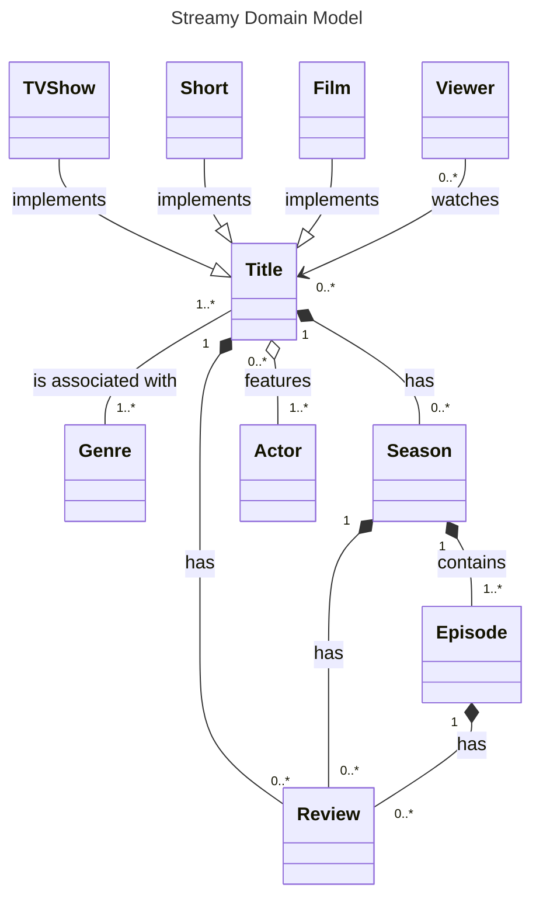
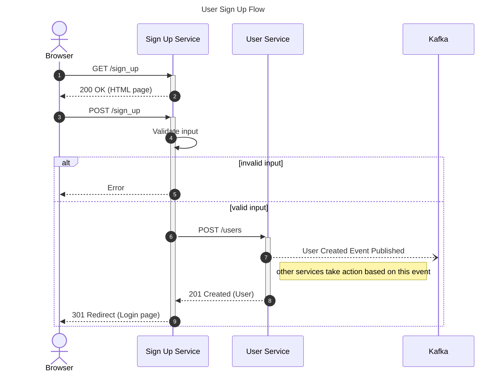
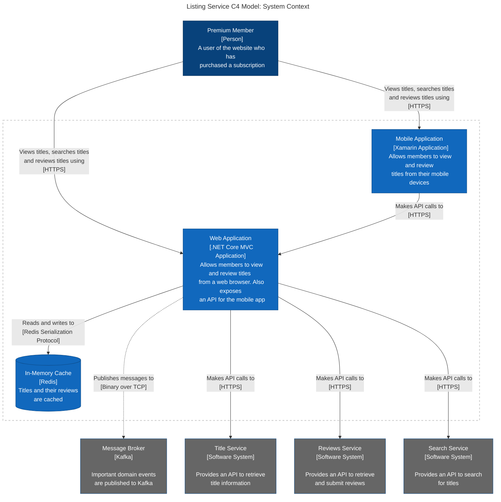
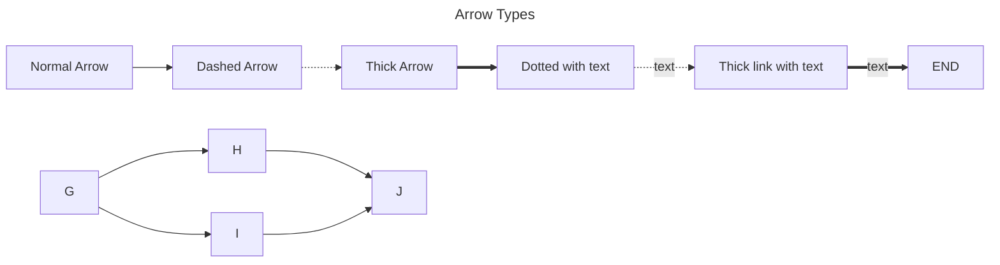
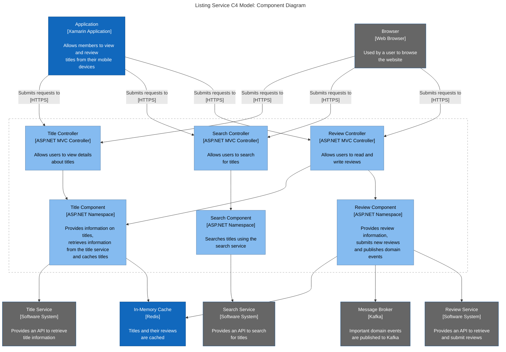
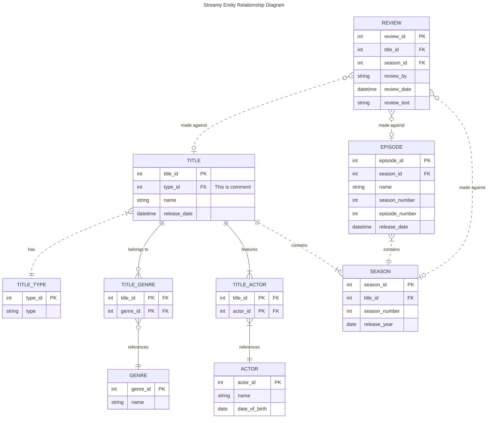
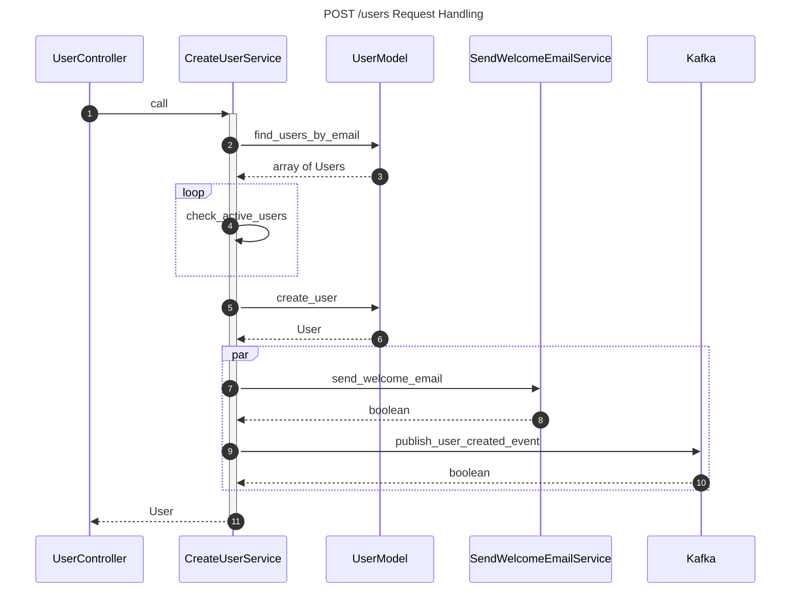
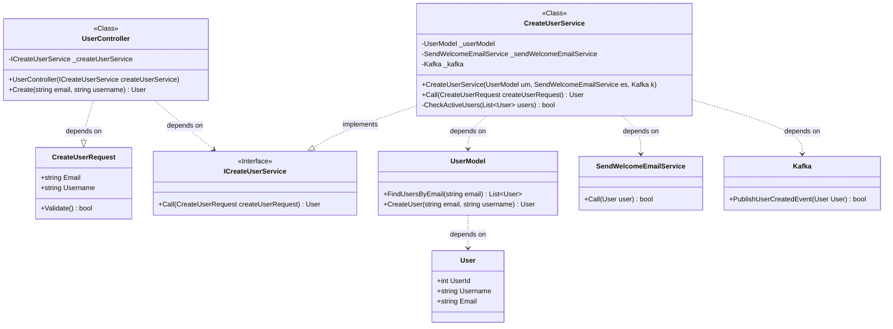

## Domain Model

## Sequence Diagram

## Flowchart Container Diagram with C4 Model and subgraphs  
container diagram details each deployable unit in your architecture

### Additional Arrow Types

## Component Diagram

## Entity Relationship Diagram
Note:
- Zero, represented by an o.
- One, represented by a |.
- Many, represented by a {.
- o{ translates to zero (minimum) to many (maximum)

Relationships:
- -- identifying relationship. Entity cannot exist without the other.
- .. non-identifying relationship. Entity can exist independent of the other.
- one-to-many (|{)
- zero-to-many (o{)
- one-to-one (||) 
- zero-or-one (o|)

## Detailed Class Diagram

## Class Diagram
